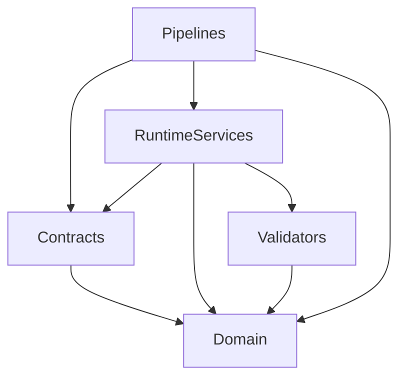

# Dependency Rules

To preserve architectural integrity, the Runtime implementation must obey the following rigid dependency injection rules.

## Allowed Dependencies
- `runtime/` modules MAY depend on `contracts/` and `domain/`.
- `pipelines/` MAY depend on `contracts/`, `domain/`, and `runtime/`.
- `validators/` MAY depend on `domain/`.

## Forbidden Dependencies
- `domain/` MUST NOT depend on `runtime/`, `validators/`, or `pipelines/`.
- `contracts/` MUST NOT depend on `runtime/` or `pipelines/`.
- A layer within `runtime/` (e.g., `runtime/knowledge/`) MUST NOT directly depend on another layer (e.g., `runtime/reasoning/`).

## Layer Isolation
Cross-layer communication is strictly forbidden. The `Reasoning Layer` cannot call methods on the `Knowledge Layer`. Both layers must return control to the `Pipeline`, which takes the output of one and provides it as the input to the other.

## Contract Isolation
Implementations must code against Interfaces, never concretions. If a pipeline needs a target intent, it asks for `ITargetContract`, never `TargetRuntimeService`.

## Validator Dependencies
Validators are pure functions. They depend only on the Entity schema they are validating. They must not make network calls, check external databases, or depend on runtime state.

## Runtime Service Dependencies
Runtime Services may depend on external I/O abstractions (e.g., `IDatabase`, `ILLMProvider`) through Dependency Injection, provided those abstractions are injected and not hardcoded.

## Circular Dependency Prevention
By forcing `domain/` and `contracts/` to the center of the architecture, and forcing `runtime/` to depend inward, circular dependencies are mathematically impossible. 

## Dependency Diagram (Pseudo)

## Future Extension Rules
Any future plugin, extension, or new content format must follow these exact dependency rules. Extensions may implement `Contracts`, but they cannot alter the dependency flow.
